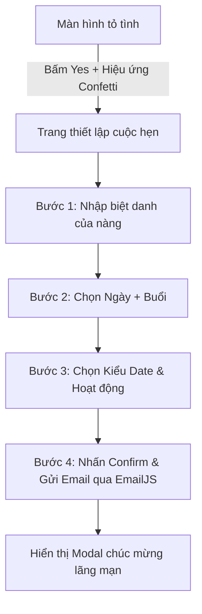

# Kế Hoạch Phát Triển Ứng Dụng Dating (Dating App Plan)

Tài liệu này phác thảo kế hoạch chi tiết để xây dựng một ứng dụng dating (tỏ tình/hẹn hò) lãng mạn, tương tác cao, sử dụng **Next.js (v16.2)**, **React (v19)**, **Tailwind CSS (v4)** và các component từ **Shadcn UI**.

---

## 1. Kiến Trúc & Cấu Trúc Thư Mục (Folder Structure)

Dự án sẽ sử dụng cấu trúc **App Router** của Next.js:

```text
app/
├── layout.tsx            # Layout gốc, chứa font chữ Quicksand/Playfair Display và cấu hình HTML
├── globals.css           # Cấu hình Tailwind v4 và các keyframes animation (tim bay, hiệu ứng nền)
├── page.tsx              # Màn hình chính (Trang tỏ tình với nút Yes/No di chuyển)
├── date-selection/       # Thư mục route cho màn hình chọn ngày và hoạt động
│   └── page.tsx          # Màn hình chọn ngày, buổi, và hoạt động (Form nhiều bước)
components/               # Các UI component tái sử dụng & Shadcn UI
│   ├── ui/               # Thư mục chứa component Shadcn (calendar, input, button, popover, etc.)
│   ├── ConfettiEffect.tsx # Hiệu ứng pháo hoa / tim bay khi bấm "Yes"
│   └── ActivityCard.tsx  # Component hiển thị các tùy chọn hoạt động (với icon & hiệu ứng hover)
```

---

## 2. Giao Diện & Thư Viện Sử Dụng (UI/UX & Libraries)

### Phong cách chủ đạo (Romantic Glassmorphism)
- **Màu sắc**: Pink gradient ấm áp (`from-pink-100 via-red-50 to-amber-50`) kết hợp với hiệu ứng Glassmorphism cho các khung thông tin.
- **Thư viện UI**: Sử dụng **Shadcn UI** cho các thành phần điều khiển nhằm tăng tính đồng bộ và thẩm mỹ:
  - **Input**: Nhập tên/biệt danh của nàng.
  - **Calendar + Popover**: Chọn ngày hẹn hò một cách trực quan, hiện đại.
  - **Button / Dialog / Label**: Các nút tương tác và hộp thoại chúc mừng.

---

## 3. Quy Trình Tương Tác Của Người Dùng (User Flow)

Khi người dùng nhấn **Yes** ở màn hình chính, họ sẽ được dẫn dắt qua luồng biểu mẫu (Form Flow) từng bước tại `/date-selection`:



### Chi tiết từng bước tại `/date-selection`:

#### Bước 1: Nhập Biệt Danh Của Nàng
- Hiển thị câu hỏi ngọt ngào: *"Tôi gọi nàng với biệt danh như nào nhỉ? 🥰"*
- Sử dụng **Shadcn UI Input** với hiệu ứng viền hồng nhẹ khi focus.
- Sau khi nhập tên, nút "Tiếp tục" sẽ xuất hiện mượt mà.

#### Bước 2: Chọn Ngày & Chọn Buổi
- **Chọn Ngày**: Sử dụng **Shadcn UI Calendar** lồng trong **Popover** giúp tối ưu hóa không gian hiển thị (đặc biệt hữu ích trên thiết bị di động). Giới hạn vô hiệu hóa các ngày trong quá khứ.
- **Chọn Buổi (Time of Day)**: Người dùng chọn một trong 4 buổi:
  - 🌅 **Sáng (Morning)**
  - ☀️ **Chiều (Afternoon)**
  - 🌆 **Tối (Evening)**
  - 🌌 **Đêm muộn (Late Night)**
- Trạng thái ngày và buổi được hiển thị tóm tắt trực quan ngay bên dưới.

#### Bước 3: Chọn Kiểu Date (Activity Selection)
Hiển thị danh sách các hoạt động dưới dạng Grid (3 cột trên desktop, 2 cột trên tablet/mobile, 1 cột trên màn hình nhỏ):
- ☕ **Coffee & Dessert** | 🍝 **Restaurant** | 🎬 **Cinema** | 🌳 **Park**
- 🎨 **Workshop** | 🎸 **Acoustic Night** | 📸 **Photobooth** | ✍️ **Your Plan**
- Nếu chọn *Your Plan*, một Shadcn Textarea sẽ xuất hiện để nhập mô tả chi tiết.

#### Bước 4: Xác Nhận & Gửi Email (EmailJS Integration)
- Khi nhấn **Confirm Date**, ứng dụng sẽ gửi email chứa toàn bộ thông tin cuộc hẹn qua **EmailJS** đến hòm thư của bạn:
  ```json
  {
    "nickname": "Biệt danh của nàng (e.g. Bé Dâu 🍓)",
    "date": "Ngày hẹn hò (e.g. 2026-06-15)",
    "time_of_day": "Buổi hẹn (e.g. Tối)",
    "activities": "Hoạt động (e.g. Restaurant, Photobooth)",
    "custom_plan": "Kế hoạch riêng (nếu có)"
  }
  ```
- Hiển thị Modal chúc mừng ngọt ngào tràn màn hình (Mobile) hoặc giữa trang (Desktop): *"Hẹn gặp [Biệt danh] vào buổi [Buổi] ngày [Ngày] nhé! 💖"*.

---

## 4. Tích Hợp EmailJS (`emailjs-com`) & Cài đặt Shadcn UI

### Cài đặt các thư viện bổ sung
```bash
npm install emailjs-com canvas-confetti lucide-react
npm install -D @types/canvas-confetti
```

### Cấu hình Shadcn UI Components
```bash
npx shadcn@latest add calendar popover input button label card dialog textarea
```

### Cấu hình biến môi trường EmailJS (`.env.local`)
```env
NEXT_PUBLIC_EMAILJS_SERVICE_ID=your_service_id
NEXT_PUBLIC_EMAILJS_TEMPLATE_ID=your_template_id
NEXT_PUBLIC_EMAILJS_PUBLIC_KEY=your_public_key
```

---

## 5. Kế Hoạch Triển Khai Chi Tiết (Implementation Steps)

1. **Bước 1: Cài đặt và cấu hình Shadcn UI**
   - Khởi tạo và tải về các component cần thiết của Shadcn.
2. **Bước 2: Xây dựng trang Tỏ Tình (`app/page.tsx`)**
   - Thiết kế giao diện lãng mạn.
   - Viết logic dịch chuyển ngẫu nhiên của nút **No** (hỗ trợ hover trên desktop và touch/click trên mobile với khoảng đệm an toàn).
3. **Bước 3: Xây dựng biểu mẫu hẹn hò từng bước (`app/date-selection/page.tsx`)**
   - Sử dụng các state React để quản lý luồng form 4 bước.
   - Tích hợp Shadcn UI Input, Calendar + Popover.
   - Thiết kế giao diện lưới responsive cho phần chọn hoạt động.
4. **Bước 4: Tích hợp chức năng gửi Email & Hiệu ứng chúc mừng**
   - Viết hàm gửi mail sử dụng `emailjs-com`.
   - Tạo hiệu ứng tim bay khi bấm xác nhận.
5. **Bước 5: Kiểm thử và Tinh chỉnh**
   - Kiểm tra khả năng tương thích trên thiết bị di động.
   - Đảm bảo các hoạt động chọn riêng (`Your Plan`) được hiển thị và gửi qua email chính xác.
